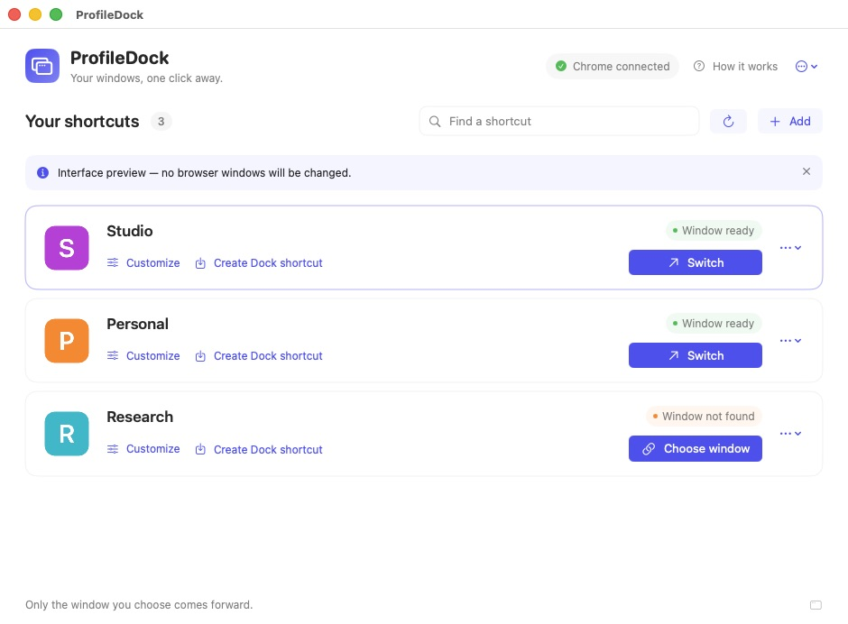

# ProfileDock

**Your Chrome windows, one Dock shortcut each.**

A small, open-source macOS utility for people who keep several Chrome profiles open. Give each working window a recognizable name and icon, then bring it forward with one click.

[Download the beta](https://github.com/kunilingvistador/ProfileDock/releases) · [Website](https://kunilingvistador.github.io/ProfileDock/)

[Setup guide](https://kunilingvistador.github.io/ProfileDock/en/guides/chrome-profile-shortcuts-mac-dock/) · [Reconnect an existing window](https://kunilingvistador.github.io/ProfileDock/en/guides/chrome-shortcut-existing-window/) · [Interactive Dock demonstration](https://kunilingvistador.github.io/ProfileDock/en/#hero-title)



**Status: early beta.** The packaging script produces an ad-hoc-signed development build by default. It is not notarized, and macOS may require manual approval before opening the downloaded app. See the [validation record](docs/VALIDATION.md) for completed checks and remaining gaps, and the [release checklist](docs/RELEASE.md) for public distribution.

## What it does

- Connects a shortcut to an existing Chrome window.
- Previews the selected window before binding, with a small Return to setup panel.
- Offers local Chrome profile names to make setup easier.
- Uses a distinct Dock helper for each shortcut, with its own label and icon.
- Assigns an optional global keyboard shortcut to each saved window; change or remove it from its card.
- Restores a minimized target and brings that window forward.
- Reports missing or ambiguous bindings instead of opening a blank window.
- Keeps Chrome control in one app, so each shortcut does not need its own Automation permission.
- Refreshes existing compatible Dock helpers when you open ProfileDock after an app update.

The switching command does not open windows or tabs, change the selected tab, or resize/reposition windows. Native focus behavior still needs broader testing across macOS configurations; see [known limits](#known-limits).

## Keyboard shortcuts

Click **Set hotkey** on a shortcut card, click the recording field, press your combination and save. Use at least two modifiers including Command or Control, for example **Option–Command–1**. Assignments are optional and remain attached to the shortcut when you rename it or reconnect its window. No Dock re-export is needed.

ProfileDock must be running in the menu bar. Closing its settings window is fine; quitting the app disables its hotkeys until the next launch. The app does not enable login startup automatically. **More options → Keyboard shortcuts enabled** pauses all assignments without deleting them. See [hotkey behavior and limitations](docs/HOTKEYS.md).

## How the connection works

Chrome exposes a window's **given name**, but its AppleScript interface does not expose which profile owns that window. ProfileDock therefore asks you to associate a profile/shortcut with a particular open window once. It stores a unique name on that window and uses the exact name when switching.

Chrome saves named windows when it restores a session. If you close the bound window, start without restoring it, or change its name, reconnect the shortcut. A newly created window in the same profile does not automatically become the old window.

This is intentionally a window switcher with profile labels. It does not clone Chrome, create isolated browser installations, or promise automatic discovery of every window belonging to an account. See the [competitor comparison](docs/COMPETITORS.md) and [architecture](docs/ARCHITECTURE.md).

## Try it locally

Running a built app requires **macOS 13 or later and Google Chrome**. Open the Chrome windows you want to use before connecting them. End users do not need Python, Swift, or Xcode.

Building from source additionally requires **Python 3 and Apple's Command Line Tools with Swift 5.9 or later**. The app build does not require the full Xcode IDE.

```sh
python3 scripts/build.py
open dist/ProfileDock.app
```

For ongoing use, move the built app to a stable location such as Applications before creating shortcuts. Allow ProfileDock to control Google Chrome when macOS asks, then select an existing window for each shortcut. Use **Show window** to check it and **Return to setup** (or Enter) to continue with the same selection. Windows already linked to another shortcut are excluded. The optional profile picker only supplies a name and picture. Keep the generated helper apps in place after adding them to the Dock. ProfileDock runs as a menu-bar utility; use its menu to reopen the manager.

The build prints the app, ZIP, and SHA-256 checksum locations. Build artifacts go to `dist/`, which is excluded from Git. SwiftPM packaging caches go to a system temporary directory unless `--scratch-path` is supplied.

```sh
python3 scripts/build.py --universal
python3 scripts/build.py --scratch-path /tmp/ProfileDock-build
```

The first command builds both Apple Silicon and Intel binaries. Without `--universal`, the app targets the build machine's architecture. CI produces development artifacts only and does not publish releases.

See the [Mac test matrix](docs/TEST-MATRIX.md) and the [performance report](docs/PERFORMANCE.md) for automated checks, measurement boundaries, and remaining live desktop tests. In the **0.1.4 (9) beta**, median internal helper-to-activation-acceptance time on one Mac fell from **206 to 141 ms** warm and **987 to 399 ms** with a cold controller. This does not measure a physical Dock click, visible frame, or keyboard readiness. Published as [v0.1.4-beta](https://github.com/kunilingvistador/ProfileDock/releases/tag/v0.1.4-beta); the downloaded archive passed checksum and signature-integrity checks.

## Update without recreating your shortcuts

ProfileDock does not download or install its own updates. Download a new release, quit ProfileDock, replace the app, and open that copy once. Settings and custom images remain in `~/Library/Application Support/ProfileDock/`. The existing UUID routes and version-1 shortcut data format are unchanged in the 0.1.3 compatibility update.

Opening the manager records that app's location and refreshes owned helpers in the managed folder, the Dock, and previously recorded locations. The usual Dock click continues to ask the controller to focus an existing window; it does not run this maintenance. If you move ProfileDock, open it once from the new location.

For compatible older AppleScript shortcuts, use **Update shortcuts** in the banner or menu. **Import existing shortcuts… → Import and update** also upgrades the original app files, including shortcuts already imported. Conversion keeps the original app path and filesystem identity, bundle ID, name, image, and Chrome window binding, and backs up the old contents first. Later name and picture edits apply to those migrated helpers too.

See [shortcut compatibility and backups](docs/SHORTCUT-COMPATIBILITY.md) for the exact scope and the 0.1.3 validation status. An app update does not restore a Chrome window that was closed or lost its name; reconnect that window separately.

## Privacy and permissions

ProfileDock does not send browser data to its developers. The app itself reads local profile names, account labels (which may include email addresses), optional profile pictures, and window names/titles for the picker. It does not read open page contents, Chrome cookies, passwords, or browsing history. Shortcut names, bindings, and pictures are stored locally, not encrypted by ProfileDock; your own backup or sync software may copy those files.

The macOS **Automation → Google Chrome** permission is broader than window switching. The controller uses it to find and name windows and bring the selected window forward; the purpose text is not a system restriction on other Chrome commands. You can revoke it in System Settings → Privacy & Security → Automation. The switcher does not require Accessibility, Screen Recording, Full Disk Access, a browser extension, or an account with ProfileDock.

Switching does not use the network. The optional website-icon downloader makes web requests: the destination receives your IP address and requested URL, without Chrome cookies or profile data. Choose a local image file to avoid those requests. The project website and downloads are hosted by GitHub, whose service logging is separate from the app. The website uses Google Analytics by default for visits and download-link clicks, with a browser opt-out in its website analytics section; this is separate from the native app, which has no analytics. The published **0.1.5 beta** adds stricter icon downloads, private storage permissions and an in-app Data and permissions screen. See [the privacy review, data map, and remaining limits](docs/PRIVACY-AND-SECURITY.md).

No personal profiles, account names, photographs, or browser data belong in this repository. Please redact those details from screenshots and bug reports.

## Known limits

- Only Google Chrome on macOS is in scope for this beta.
- Each shortcut binds to an existing, named normal window. Incognito windows are excluded from persistent bindings.
- Changing or losing that window's name requires reconnecting it. Duplicate names never choose an arbitrary match.
- Profiles with several windows need an explicit choice of which window a shortcut represents.
- Spaces, fullscreen windows, Stage Manager, multiple monitors, and app-wide Hide need additional integration testing before support can be promised.
- Local ad-hoc builds may require macOS approval, and permissions can change after rebuilding. This is not a signed, notarized public release.

## Development

The project uses Swift Package Manager, AppKit/SwiftUI, and Apple events. It has no browser extension or bundled Chromium runtime. The controller is `ProfileDock`; the generic Dock helper is `ProfileDockLauncher`.

For interface-only QA, quit any running ProfileDock instance first, then launch a preview with sample shortcuts:

```sh
open dist/ProfileDock.app --args --demo --demo-dark --demo-compact
```

`--demo-dark` gives the preview window a dark appearance; `--demo-compact` starts it at the minimum 860 × 600 window size. Both flags require `--demo` and can be used independently. They do not change system preferences or control Chrome. Quit the preview with ⌘Q when finished.

Run `swift test` for core model and parsing checks with a full Xcode installation selected: the XCTest framework is not included in the standalone Command Line Tools environment used for this project's initial build. The GitHub macOS runner has Xcode for these tests. Real window activation must also be checked on macOS: unit tests cannot verify Dock behavior or preservation of other windows. See the [architecture and integration checklist](docs/ARCHITECTURE.md).

The original app icon is drawn with AppKit by `scripts/make-app-icon.swift`. The source and that artwork are covered by the [MIT license](LICENSE). Chrome and other product names belong to their respective owners; this is an independent project.

## По-русски

ProfileDock делает отдельные значки в Dock для уже открытых окон Chrome. Один раз связываете значок с нужным окном, задаёте название и картинку — дальше переключаетесь одним нажатием.

Это локальная бета. Привязка использует уникальное название окна: после закрытия окна или изменения его названия понадобится связать его заново. Новые пустые окна при переключении не создаются. Для удобного публичного скачивания ещё нужны подпись Developer ID, нотариализация Apple и проверка на разных Mac.

При обновлении замените приложение ProfileDock и откройте новую копию один раз: настройки и картинки сохраняются, существующие совместимые ярлыки обновляются. Для старых ярлыков есть кнопка **«Обновить ярлыки»**; она сохраняет их расположение, имя и изображение, предварительно создавая резервную копию. После переноса приложения также откройте его из нового места. Автоматического скачивания обновлений пока нет. [Подробнее о совместимости](docs/SHORTCUT-COMPATIBILITY.md).

В бета-версии 0.1.4 сократили работу при переключении. [Отчёт с измерениями](docs/PERFORMANCE.md) показывает время от начала работы ярлыка до принятия команды активации; появление окна и готовность к вводу этой метрикой не измеряются. [Версия опубликована](https://github.com/kunilingvistador/ProfileDock/releases/tag/v0.1.4-beta); контрольная сумма и целостность подписи скачанного архива проверены.
