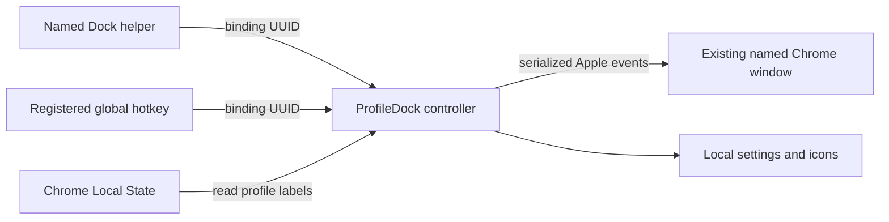

# Architecture

ProfileDock uses one native controller and lightweight Dock helpers. Its central promise is an explicit connection to an existing Chrome window, with no automatic new-window fallback.

## Components

`ProfileDockCore` owns models, binding resolution, local profile discovery, configuration persistence, and route validation. It can be tested without controlling Chrome. `ProfileDock` owns the manager UI, icon/shortcut generation, and Apple events. `ProfileDockLauncher` forwards a binding UUID to the controller through a `profiledock://focus/<UUID>` event. The helper never controls Chrome directly.

The controller bundle identifier is `io.github.profiledock.app`. It declares the custom URL scheme and an Automation purpose string. The build packages the generic helper executable at `Contents/Resources/ProfileDockLauncher`; generated shortcut bundles contain configuration specific to a binding. User data lives outside the controller bundle so customization does not invalidate a release signature.

## Identity and restoration

The installed Chrome scripting dictionary exposes a writable `given name`, window ID, order, minimized state, and mode. It does not expose a window's profile directory. Chromium implements the given name as user-title metadata; session restoration carries it into restored windows. [Chrome AppleScript implementation](https://raw.githubusercontent.com/chromium/chromium/main/chrome/browser/ui/cocoa/applescript/window_applescript.mm), [window metadata](https://raw.githubusercontent.com/chromium/chromium/main/chrome/browser/ui/window_metadata/window_metadata_controller.cc), [session restoration](https://raw.githubusercontent.com/chromium/chromium/main/chrome/browser/sessions/session_restore.cc).

A shortcut therefore has its own UUID, display name, exact bound window name, optional profile directory, and icon reference. The profile directory helps present the connection; it is not evidence that a particular window belongs to that profile. The user chooses the window during setup. An existing unique name can be adopted; a new binding can receive a readable name with a unique suffix.

Resolve the exact current name every time. Zero matches means missing, more than one means ambiguous, and incognito windows are excluded. Window IDs are transient selectors, not persistent profile identifiers. Never fall back to a matching page title, email, URL, window order, or new window.

Read `profile.info_cache` in Chrome's Local State for profile labels and optional avatar metadata. This is an internal file format: parsing must tolerate absent fields and failure. Never modify Chrome's profile files. [Chromium profile attributes](https://raw.githubusercontent.com/chromium/chromium/main/chrome/browser/profiles/profile_attributes_entry.cc).

## Chrome control

Use one serialized background queue for in-process NSAppleScript work, and return to the main queue for UI and AppKit activation. Apple DTS confirms that NSAppleScript may run off the main thread when calls are serialized; synchronous script execution can otherwise block the interface. [Apple DTS guidance](https://developer.apple.com/forums/thread/759287).

Typed script-handler arguments prevent user labels from becoming script source. Parse structured Apple-event results rather than splitting arbitrary titles on tabs or newlines. Check that Chrome is already running before sending browser commands. Report permission denial, missing windows, ambiguity, and errors separately.

After resolving a unique target, unminimize only that window, set its index to the front, and activate the existing Chrome process using empty `NSRunningApplication` activation options. Do not use AppleScript `activate` or `.activateAllWindows`: those can bring unrelated profile windows forward. The native API distinguishes default activation from activation of every window. [NSRunningApplication](https://developer.apple.com/documentation/appkit/nsrunningapplication).

Shortcut URL events accept only configured UUIDs and supported routes. Their operation must be the same on a cold or warm controller launch. The manager should not appear on every shortcut click. Opening the controller by explicit app URL avoids depending only on the system's default custom-scheme handler. [NSWorkspace launch configuration](https://developer.apple.com/documentation/appkit/nsworkspace/openconfiguration).

## Integration checks before release

Core tests cover name matching, duplicate handling, route validation, storage, and parsing. They cannot prove macOS window behavior. On a disposable Chrome test setup, verify:

- Correct target with other Chrome windows and another app interleaved in front.
- Repeated clicks and quick switches between different shortcuts.
- Minimized target, Chrome absent, permission denied, and a closed or renamed target.
- Restored named windows after Chrome restart, and startup without restoration.
- Duplicate window names, unusual Unicode/quotes/newlines, and stale bindings.
- Warm/cold controller and helper launches, a moved controller, and removed helpers.
- Multiple Spaces, fullscreen, Stage Manager, multiple displays, and app-wide Hide.

Compare tab counts/IDs, selected tabs, geometry, minimized states, and the relative order of other windows. Do not collect URLs or page contents for this check. Report untested environments as limits rather than claiming universal support.

## Distribution boundaries

The packaging script creates a native app and ZIP with Command Line Tools. Ad-hoc signing is useful for local development. A public consumer release needs a stable Developer ID identity, Hardened Runtime, and notarization. Keep profile-specific configuration and icons outside the signed controller. See [RELEASE.md](RELEASE.md).

## Global hotkeys (0.1.6)

`HotKeyCoordinator` validates a separate `hotkeys.json` document, reconciles known binding UUIDs with a registration adapter, and preserves working registrations if a new registration or disk commit fails. Unknown UUIDs never invoke an action. `CarbonHotKeyBackend` registers selected combinations exclusively through RegisterEventHotKey and delivers pressed/released identifiers on the main actor. It does not monitor the global stream of typed text. The recorder is an AppKit button receiving keys only while focused in the editor; registrations are temporarily released while that editor is open.

Hotkey invocation calls the same `AppModel.switchTo` / `ChromeService.focus` path as the Dock route. No helper launch, URL delivery, profile refresh, or successful manager presentation is involved. Repeat presses are suppressed until release. Sleep and recording suspension are tracked separately; wake must not enable shortcuts while recording. Assignment storage is separate from the version-1 shortcut file so an older controller does not discard it when saving names or bindings.
